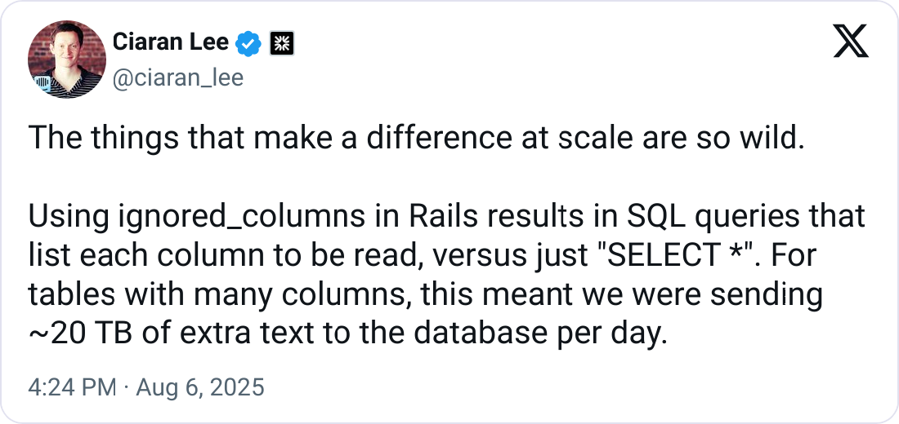

# SmartIgnoredColumns

[](https://x.com/ciaran_lee/status/1953084875193385200)

Now you won't forget to delete those ignored columns.

## Requirements

- ruby 3.2+
- activerecord 7.2+

## Installation

Add this line to your application's Gemfile:

```ruby
gem "smart_ignored_columns", group: [:development, :test]
```

## Usage

1. Specify deadlines when ignoring columns:

```ruby
class User < ApplicationRecord
  self.ignored_columns += [
    { name: "first_name", remove_after: "2025-08-24" } # date can be a String or a Date
  ]
end
```

2. Run a check on CI to warn when it is time to remove ignored columns:

```sh
bundle exec rake smart_ignored_columns:obsolete
```

If there are any obsolete ignored columns, the check will print them and exit with an error status code.

If you want to print all ignored columns with their deadlines, run:

```sh
bundle exec rake smart_ignored_columns:list
```

## Development

To install this gem onto your local machine, run `bundle exec rake install`. To release a new version, update the version number in `version.rb`, and then run `bundle exec rake release`, which will create a git tag for the version, push git commits and the created tag, and push the `.gem` file to [rubygems.org](https://rubygems.org).

## Contributing

Bug reports and pull requests are welcome on GitHub at https://github.com/fatkodima/smart_ignored_columns.

## License

The gem is available as open source under the terms of the [MIT License](https://opensource.org/licenses/MIT).
